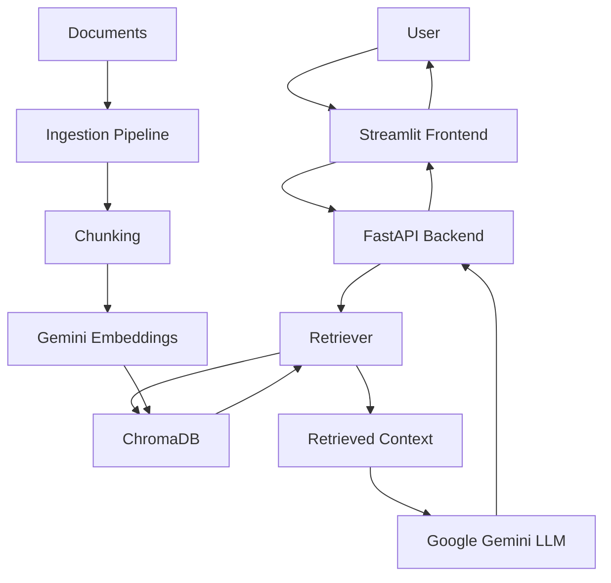

# Permission-Aware Enterprise RAG System

> **Current Phase: Phase 1 — Basic RAG Pipeline (Powered by Google Gemini)**  
> *Note: Enterprise Security features (JWT authentication, role-based authorization, permission-aware document retrieval, and audit logging) will be implemented in subsequent phases.*

---

## 📖 Overview

The **Permission-Aware Enterprise RAG System** allows enterprise employees to query internal knowledge bases (project documentation, support tickets, Slack channels) with natural language questions and receive accurate, grounded answers accompanied by verifiable source citations.

Phase 1 establishes a fully functional, end-to-end RAG architecture consisting of an automated ingestion pipeline, vector persistence in ChromaDB, query retrieval, grounded completion via Google Gemini foundation models (`gemini-2.5-flash` / `text-embedding-004`), FastAPI REST endpoints, and an interactive Streamlit frontend.

---

## 🏗️ Architecture



---

## 🛠️ Technology Stack

### Backend & AI
- **Python 3.13+**
- **FastAPI**: Asynchronous web API framework
- **Uvicorn**: ASGI server
- **LangChain & LangChain Google GenAI**: RAG abstractions & Gemini model integrations
- **ChromaDB**: Local vector database
- **Google Gemini API**: Embeddings (`models/text-embedding-004`) and LLM (`gemini-2.5-flash`)
- **Pydantic / Pydantic Settings**: Data validation & environment management

### Frontend
- **Streamlit**: Modern interactive web interface
- **HTTPX / Requests**: REST API client communication

---

## 📂 Project Structure

```text
permission-aware-rag/
│
├── backend/
│   ├── app/
│   │   ├── main.py                     # FastAPI application entry point
│   │   ├── api/
│   │   │   └── chat.py                 # Chat API endpoint definition
│   │   ├── core/
│   │   │   └── config.py               # Configuration & environment variables
│   │   ├── schemas/
│   │   │   └── chat.py                 # Pydantic request/response schemas
│   │   ├── services/
│   │   │   ├── ingestion_service.py    # Document processing service
│   │   │   ├── retrieval_service.py    # Chunk retrieval service
│   │   │   └── rag_service.py          # RAG orchestration service
│   │   └── rag/
│   │       ├── loaders.py              # MD, TXT, JSON loaders
│   │       ├── chunker.py              # Metadata-preserving text splitter
│   │       ├── embeddings.py           # Gemini embeddings wrapper
│   │       ├── vector_store.py         # ChromaDB persistence manager
│   │       ├── retriever.py            # Vector similarity search retriever
│   │       └── prompts.py              # Strict RAG system & user prompts
│   │
│   ├── data/                           # Synthetic Enterprise Knowledge Base
│   │   ├── project_docs/               # Markdown project specification docs
│   │   ├── support_tickets/            # Support ticket JSON files
│   │   └── slack/                      # Slack chat conversation JSON files
│   │
│   ├── scripts/
│   │   └── ingest.py                   # Data ingestion CLI runner
│   │
│   ├── tests/                          # Test suite (Health, Validation, Retrieval, Fallback)
│   │   ├── conftest.py
│   │   ├── test_health.py
│   │   ├── test_chat_validation.py
│   │   ├── test_retrieval.py
│   │   └── test_no_answer.py
│   │
│   ├── requirements.txt
│   ├── .env.example
│   └── README.md
│
├── frontend/
│   ├── app.py                          # Streamlit UI dashboard
│   ├── services/
│   │   └── api_client.py              # FastAPI HTTP client wrapper
│   ├── requirements.txt
│   └── README.md
│
├── .gitignore
└── README.md
```

---

## 🚀 Quickstart Guide

### 1. Environment Setup

Copy `.env.example` in the `backend/` directory to `.env` and configure your Google Gemini API Key:

```bash
cp backend/.env.example backend/.env
```

Edit `backend/.env`:

```env
GEMINI_API_KEY=AIzaSy...your-gemini-api-key...
GEMINI_CHAT_MODEL=gemini-2.5-flash
GEMINI_EMBEDDING_MODEL=models/text-embedding-004
CHROMA_PERSIST_DIRECTORY=./chroma_db
CHUNK_SIZE=800
CHUNK_OVERLAP=100
TOP_K=5
```

---

### 2. Install Dependencies

In your activated virtual environment:

```bash
pip install -r backend/requirements.txt
pip install -r frontend/requirements.txt
```

---

### 3. Ingest Enterprise Data

Run the document ingestion script from the root or `backend` folder:

```bash
cd backend
python scripts/ingest.py
```

*Expected output:*
```text
==================================================
Starting Enterprise Data Ingestion Pipeline (Gemini)
==================================================

Loading documents...
Loaded 8 documents.

Creating chunks...
Created 8 chunks.

Generating Gemini embeddings...
Using embedding model: models/text-embedding-004

Storing vectors in ChromaDB...
Stored 8 vectors into ChromaDB.
Ingestion completed successfully.
```

---

### 4. Run Backend Server (FastAPI)

Start the FastAPI application on port 8000:

```bash
cd backend
uvicorn app.main:app --reload --port 8000
```

Verify backend health at `http://localhost:8000/health`.

---

### 5. Run Frontend Interface (Streamlit)

In a separate terminal window:

```bash
cd frontend
streamlit run app.py
```

Open `http://localhost:8501` in your browser.

---

## 💬 Example Queries & Responses

### Query 1: Project Delivery Commitment
- **Question:** *"What delivery date was promised to ABC Corp?"*
- **Response:** *"The team committed to delivering the payment integration to ABC Corp by September 25, 2026."*
- **Sources Used:** 📄 `Project Alpha` | 💬 `Slack #project-alpha`

### Query 2: Support Ticket Resolution
- **Question:** *"What issue is customer ABC Corp having?"*
- **Response:** *"Payment integration is failing for some users during checkout due to API timeouts with the payment gateway."*
- **Sources Used:** 🎫 `Support Ticket TICKET-001 (ABC Corp)`

### Query 3: No-Answer Fallback (Anti-Hallucination)
- **Question:** *"What was the company's revenue in 2024?"*
- **Response:** *"I couldn't find information in the available knowledge base that answers this question."*
- **Sources Used:** *(None)*

---

## 🧪 Running Tests

Execute the automated test suite with `pytest`:

```bash
python -m pytest backend/tests/ -v
```

---

## 🗺️ Roadmap to Future Phases

- **Phase 2: Authentication & User Roles**: JWT integration, RBAC user directory.
- **Phase 3: Permission-Aware Retrieval**: Document access control list (ACL) filtering at vector search time.
- **Phase 4: Hybrid Search & Reranking**: Combining dense vector embeddings with BM25 keyword search and Cross-Encoder reranking.
- **Phase 5: Audit Logging & Security Compliance**: Access logging, prompt injection protection, and response sanitization.
